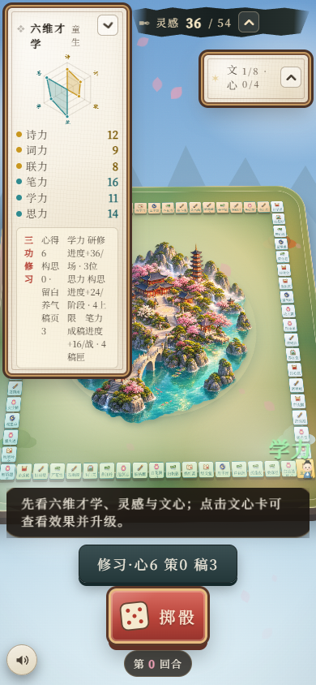
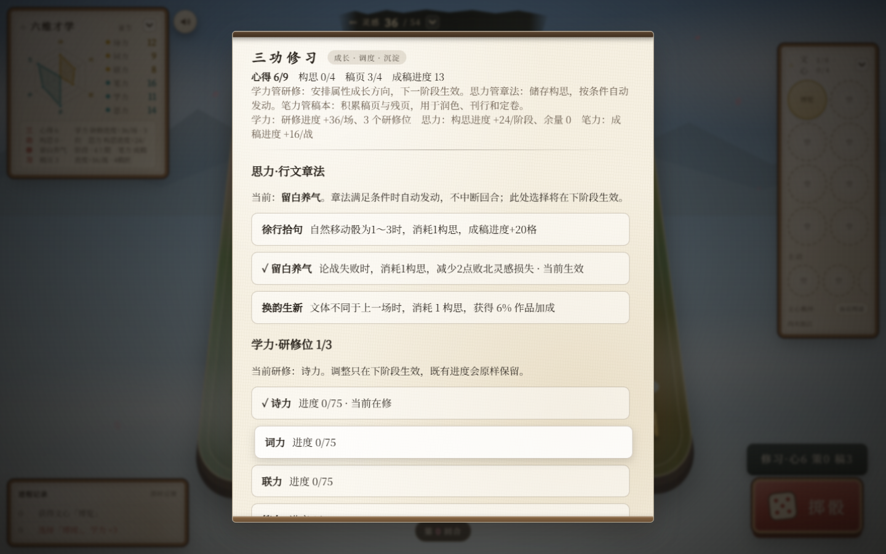

# 文心棋 UI 与功能文案排查及修改方案

版本：v1 · 2026-09-10  
性质：供评审与后续实施的方案；本次不修改游戏运行代码，不调整数值规则。

## 1. 结论与范围

优先处理三类问题：**三功区域被压成碎片文字、操作前缺少真实费用、当前状态与待生效设置不易区分**。保留水墨、宣纸和文学命名，用清楚的功能副标题、资源标签和操作结果帮助玩家理解。

本次检查 HUD、三功修习、文心详情与升级、论战追加骰提示及部分通用弹窗。依据为 GitHub main 基线 `309547e1b3fc88561656087d7a0d0c82062b0089`（小整数 v2.1）。这是重点路径排查，不等同于所有事件、图鉴、终局和全部文心组合的穷举验收。

证据分级：**A＝浏览器组件复现并截图；B＝源码确认；C＝待交互验证的风险或建议**。截图使用本地正式组件和模拟中局状态，配置来自该基线，非云端实机截图。浏览器为无头 Edge，未覆盖实体手机、屏幕阅读器或系统放大。手机截图主动展开六维面板；默认折叠状态不能据此判定同样拥挤。

## 2. 可复核的布局证据

| 视口 | 三功区域宽×高 | 标题实际宽度 | 字号 | 修习弹窗可视高／内容高 | 关闭按钮在首屏 |
|---|---:|---:|---:|---:|---|
| 1440×900 | 222×78 | 12.28 | 11px | 790／1981 | 否 |
| 1280×720 | 222×78 | 12.28 | 11px | 632／1981 | 否 |
| 768×1024 | 222×78 | 12.28 | 11px | 899／1981 | 否 |
| 390×844 | 126×174 | 11 | 11px | 818／2145 | 否 |

数据单位除特别说明外均为 CSS 像素。长弹窗本身不构成错误；这里的问题是可操作内容被规则与叙事分隔，且关闭入口位于末尾。





其余截图、测量 JSON 和复现脚本见 [证据目录](ui-audit-20260910/README.md)。

## 3. 问题清单与优先级

P1：影响理解、决策或操作可用性，首批处理。P2：影响效率与一致性，第二批处理。P3：需额外验证后再决定。不以视觉问题名义更改资源规则。

| ID／级别 | 现象与影响 | 修改建议 | 证据／定位（基线行号） |
|---|---|---|---|
| U01 P1 | 三功标题、资源、三段推导说明挤在一个 flex 行；标题近乎逐字换行 | 标题独占一行，资源逐行成组；推导移入详情 | A；`js/ui/hud.js:223`、`css/ui.css:907` |
| U02 P1 | 三功首屏连放三段说明，稿本在研修、心得、可选叙事之后 | 按“查看资源—选择功能—执行”组织；学力、思力、笔力分区，叙事折叠 | A/B；`js/ui/modals.js:312` |
| U03 P1 | 稿本三个按钮未列消耗，余额不足和定卷满额仍可点击 | 显示实际费用、收益、上限与不可用原因；状态取自引擎 | B；`modals.js:355`、`js/engine/game.js:729` |
| U04 P1 | 文心详情按原价判断升级可用性；引擎另算奇士折扣，可能错误禁用 | 升级预览、按钮、实际扣款统一读取费用查询结果 | B；`modals.js:599`、`game.js:1530` |
| U05 P1 | ✓ 表示下阶段选择，文字“当前在修／当前生效”表示本阶段；研修数量也显示当前数量 | 分开显示“本阶段生效”和“下阶段安排”，待生效选择明确标识 | B；`modals.js:342` |
| U06 P1 | 成稿只有进度数，没有成页门槛；构思“余量”无解释 | 显示当前进度／实际门槛与用途；详细换算规则放展开说明 | B；`modals.js:337` |
| U07 P2 | 成功反馈只说“心得已经兑现／稿本已经付梓”，看不出扣了什么、获得什么 | 返回资源与属性变化的具体回执；不同稿本操作各用对应动词 | B；`modals.js:371` |
| U08 P2 | “下一场首次追加”可能让玩家误以为润色会在下一场未使用时失效 | 明确实际触发条件及未使用时保留；文案由真实消费条件校验 | B；`game.js:2892`、`game.js:3652` |
| U09 P2 | 文心详情在升级预览前插入联动，文学文本与通用说明重复抢占重点 | 当前效果→升级前后变化→费用与按钮→联动→典故 | B；`modals.js:569` |
| U10 P2 | “被动文心 常驻生效”掩盖条件触发；“主动需在论战中发动”不能覆盖所有主动类型 | 分别说明触发时机、条件与使用位置；根据效果类型生成 | B；`modals.js:589`、`modals.js:623` |
| U11 P2 | “技法筹备（方案 C）”把内部规划术语暴露给玩家 | 去掉方案编号；无可用操作时不占主操作区，必要记录放修习记录 | B；`modals.js:361` |
| U12 P2 | 追加骰限时阶段同时介绍两类乘区、费用、点数收益和上限 | 先呈现两种可执行选择与实际费用，算分术语移入展开明细 | B；`js/ui/battle.js:335` |
| U13 P2 | HUD “心／策／稿”“4上限”“4稿匣”单位缺失或简称不一致 | 统一“心得／构思／稿页”；明确“构思上限”“稿页容量” | A/B；`hud.js:233`、`hud.js:294` |
| U14 P3 | 通用 open 没有在该方法中设置初始焦点、焦点约束、Escape 返回；三功整块重绘可能丢失焦点 | 专项验证全局处理；确认后统一弹窗焦点和返回行为 | C；`modals.js:164`、`modals.js:364` |
| U15 P2 | 主菜单“小整数 v2.1 · 研修75成长 · 成稿20/40成页”先向新玩家呈现实现与门槛术语 | 主入口保留玩法目标；版本与换算规则移入版本说明／对应功能详情 | B；主菜单模板与小整数发布文案 |

U04 是应优先修复的功能一致性缺陷，不能仅换按钮文字。源码中详情直接使用 `up.upCost[level-1]`，引擎奇士费用为 `ceil(baseCost × upgradeCostRate)`、最低 1。假设原价 6、折扣系数 0.8，则引擎需 5，而详情按 6 禁用；该例说明公式差异，不冒充特定卡牌的实机复现。后续必须选用配置内实际卡牌做端到端回归。

## 4. 三功修习改版结构

### 4.1 棋盘 HUD：只保留当前状态与入口

展开面板建议：

```text
三功修习                    [查看]
心得 6/9        构思 0/4
稿页 3/4
章法：留白养气
```

窄屏使用一列资源行，禁止三个长文本块横向争抢宽度；默认折叠时保留简短标题与展开按钮。底部入口改为“修习”，如需提示可用操作，用文字“可分配心得”或可访问状态说明，不重复神秘缩写。研修速度、成稿速度、换算余量放入详情，不在棋盘常驻展示。

### 4.2 修习弹窗：固定标题与资源，分区查看

```text
三功修习                              [关闭]
心得 6/9       构思 0/4       稿页 3/4
[学力·成长]   [思力·章法]   [笔力·稿本]
------------------------------------------------
本阶段研修：诗力
下阶段安排：诗力、词力              已选 2/3
调整后自动保存，下阶段生效；已有进度保留。
[诗力 ✓ 下阶段]  当前进度 52/75 · 本阶段在修
[词力 ✓ 下阶段]  当前进度 15/75
...
分配心得（立即生效）
诗力 12 → 13                 [消耗实际心得数]
------------------------------------------------
[研修规则 ▾]    [修习记录 ▾]
```

这是结构示意，示例数字不是新平衡方案。桌面可将属性选项做两列，但单个选项内部上下排列“名称／状态／进度”；手机一列。标签必须能用键盘操作，切换后保留各分区滚动位置。可选流派“问心转化”独立成完整卡片，显示其资源、概率、次数与不可用原因，不塞进学力说明。

不增加“确认提交”步骤：保留现有选择后自动保存、下阶段生效的行为。切换后就地反馈“下阶段安排已保存”，保持焦点；本阶段标签不随待生效选择改变。

思力区依次显示：本阶段章法、下阶段章法、当前构思、触发条件→消耗→效果。明确阶段补充规则，避免把构思描述为无限跨阶段积累；具体补充量及结转以引擎为准。

笔力区依次显示：稿页余额与容量、成稿进度／动态门槛、三种用途。润色／刊行／定卷每张卡包含效果、实际费用、可用状态；定卷另显示本局次数。不把“成稿进度”与“稿页”混用。满灵感刊行是否禁止，作为单独交互决策：建议阻止零收益消耗，并显示原因；这项需在实施时明确为行为调整。

### 4.3 排版约定

采用项目统一字号变量；正文桌面 15px、手机 16px，辅助信息 13–14px，核心数值 20–24px，正文行高 1.55–1.7。以上是项目设计目标，不是本次测得的现状。正文不使用标题式宽字距，不把整个操作说明设为灰色。

按钮名称不被挤成单字列；描述允许自然换行。弹窗主体滚动，标题与关闭入口保持可见；窄屏预留安全区。可点击区域目标至少 44×44 CSS 像素。禁用原因不能只依赖悬停，选中状态不能只依赖颜色。

## 5. 功能文案替换清单

花括号为运行时数据，不能把示例数值硬编码进 UI。每条功能说明按“什么时候／花什么／得到什么／限制”组织；文学名保留在标题或次级典故。

| 场景／现文案 | 建议文案 |
|---|---|
| 成稿进度 13 | 成稿进度 13/{实际门槛}；满额转为稿页（容量限制另行说明） |
| 学力 研修进度+36/场 · 3位 | 可安排 3 个研修方向；每次符合条件的结算，各方向获得 36 研修进度。详细结算时机与引擎核对后定稿 |
| 构思进度+24/阶段 · 4上限 | 构思 0/4。阶段补充详情：进度 +24，按规则换算为构思；余量在说明中展示 |
| 学力·研修位 1/3 | 本阶段在修 1 项；下阶段已安排 {待生效数}/3 项 |
| 下阶段研修方向已更新 | 下阶段安排已保存；本阶段仍研修{当前方向} |
| 消耗 4 心得 | 消耗{实际费用}心得，{属性名} {当前值}→{新值}；立即生效 |
| 心得已经兑现 | 已消耗{实际费用}心得，{属性名}+1（现为{新值}） |
| 润色：下一场首次追加少耗2灵感 | 为符合条件的首次追加骰减免{减免额}灵感；未使用则保留。按钮：润色 · {实际费用}稿页 |
| 刊行：恢复4灵感 | 灵感 {当前值}→{实际恢复后值}（最多恢复4）；按钮：刊行 · {实际费用}稿页 |
| 定卷：终局文采+60（0/2） | 终局文采+60；本局已定卷0/2。按钮：定卷 · {实际费用}稿页 |
| 稿本已经付梓 | 已刊行：消耗{稿页数}稿页，恢复{实际恢复数}灵感。润色／定卷各给独立回执 |
| 升级（消耗灵感原价） | 升级至{等级} · {折后实际费用}灵感；折扣存在时辅助显示原价与来源 |
| 被动文心 常驻生效 | 被动文心 · {满足条件自动触发／获得时生效／持续生效}，按效果类型选择 |
| 主动文心需在论战中发动 | 使用时机：{棋盘阶段／论战具体步骤}；每{作用周期}可用{次数}次 |
| 追加骰长段规则 | 主按钮“追加1骰 · {本次费用}灵感”；辅助“使用后剩余{灵感}，本场还能追加{次数}次”；另一按钮“收笔结算” |
| 作品乘区 +X% | 作品加成 +X%；展开算分明细解释所在乘区，不暗示最终总分必然增加X% |

费用、剩余量和实际恢复量来自统一查询与执行回执；上限、折扣、返还、保留等效果必须分别表达。不能仅在静态内容 JSON 改字后宣告所有动态描述已经统一。

## 6. 其他界面的修改边界

文心详情：只出现一次等级；升级前后并排或上下对照，突出发生变化的数值。联动改为“已生效／还缺什么”摘要，完整列表可展开；典故后置。获取时生效与持续效果必须区分，不能统一称常驻。

论战：限时步骤优先展示当前决定与代价；解释“作品加成”和“临场加成”的关系放入明细。未知随机点数不预告确定收益或胜率。NPC 提示仅使用玩家当前已识破的信息，不借可读性优化泄露隐藏机制。

通用反馈：失败指出可解决的原因，如“稿页不足：还差2页”“本局定卷已达2次”；成功回执显示实际变化。关闭、返回、收笔、结束本场按动作区分，避免文学动词同时承担多个不同操作。

## 7. 实施拆分与验收

| 批次 | 工作包 | 主要文件 | 验收重点 |
|---|---|---|---|
| 第一批 | U01 三功 HUD 重排；U03/U04 费用统一；U05 当前与下阶段区分 | `hud.js`、`ui.css`、`modals.js`、引擎费用查询接口 | 标题不逐字断行；显示费用等于扣款；折后余额足够可以操作 |
| 第二批 | 修习分区、固定关闭、进度解释、操作回执、文心比较 | `modals.js`、`ui.css`、执行结果回执 | 稿本一步可达；完整显示代价；切换与重绘不丢焦点 |
| 第三批 | 战斗说明、术语统一、键盘与长文专项回归 | `battle.js`、提示生成、内容配置 | 限时决策可读；无隐藏信息泄露；长文与缩放可操作 |

先添加只读费用查询（接口名称待实现确定），供按钮、预览和执行共同调用；执行时重新校验余额，不能信任旧预览。不要在 UI 复制奇士折扣、词宗润色优惠或定卷返还公式。

必测状态：资源为0、恰好足够、差1、满容量；奇士折扣；词宗首次润色优惠；满灵感刊行；定卷满次数；当前与下阶段选择不同；研修位满和禁止清空；长名称与多条联动；润色未触发跨场保留。

布局验收使用本次四种视口，追加 200% 浏览器缩放与实体手机。要求无横向裁切、无逐字标题、关闭入口始终可达、主要操作不依赖悬停。键盘验收包括打开后的焦点、Tab 顺序、返回后焦点恢复，以及点击研修选项后焦点保持。U14 在确认全局监听行为后再决定修复范围。

建议邀请3–5位未参与设计的试玩者，分别回答“现在可花什么”“点击后立即生效还是下阶段生效”“这次实际要花多少”“进度还差多少”。记录错误理解与寻找操作所需时间；这是后续验证计划，本次未声称已开展用户测试。

## 8. 本次交付验证与限制

已完成四视口组件截图与 DOM 尺寸采集，并人工检查重点截图；具体数据可复跑。源码问题均给出入口，推论与建议单独标明。此次仅提交方案和证据，不运行与文档无关的完整游戏测试，不声称 UI 缺陷已经修复。后续实施应另开独立提交、备份标签并完成对应回归。

